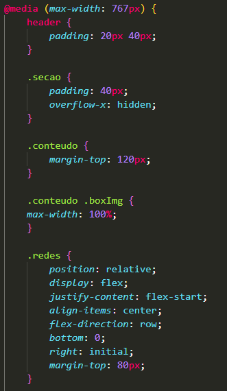
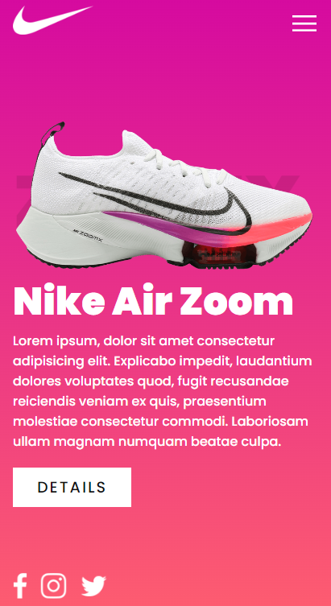
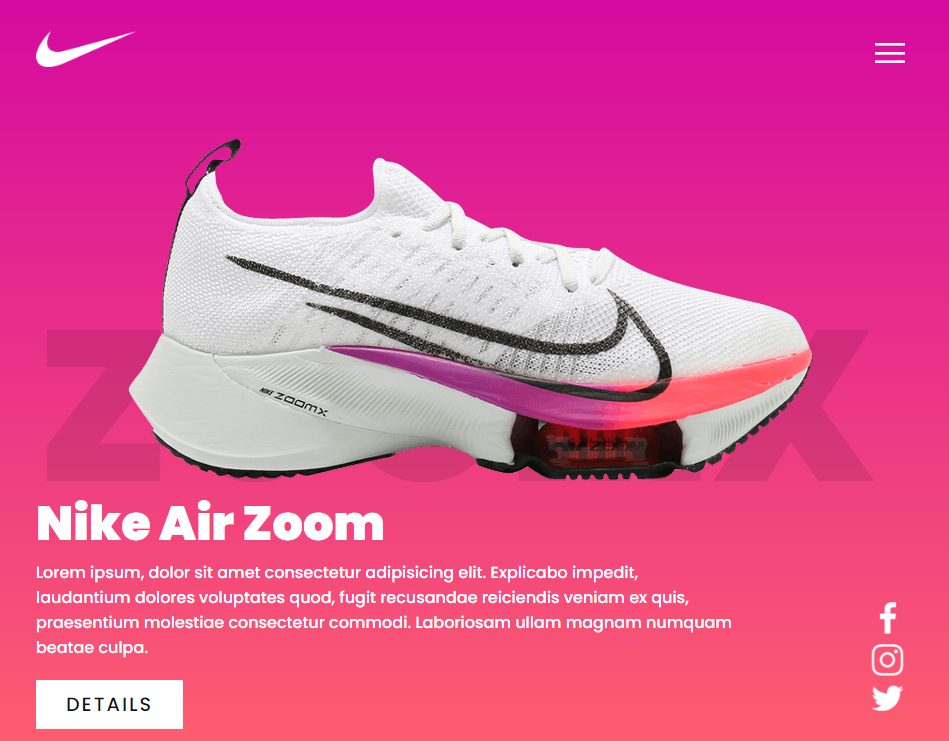
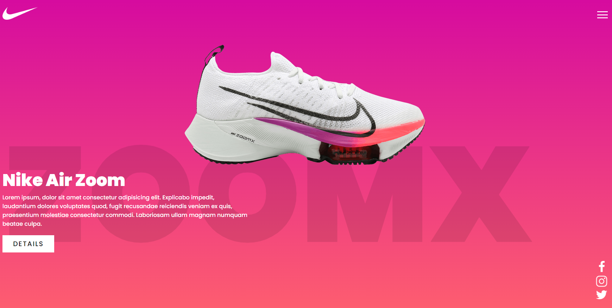

<h1 align="center">:triangular_ruler: Nike AirZoomX</h1>

# :memo: Índice
* [:chart_with_upwards_trend: Proposta]()
* [:trophy: Desafio]()
* [:hammer_and_wrench: Tecnologias]()
* [:dart: Objetivo]()
* [:open_book: Aprendizado]()
* [:camera: Imagens do Projeto]()
* 1. [:iphone: :computer: :desktop_computer:Responsividade]()
* 2. [:movie_camera: Vídeo Apresentação do Projeto]()
* 3. [:iphone: Mobile]()
* 4. [:computer: Tablet]()
* 5. [:desktop_computer: Desktop / Notebook]()
* [:link: Links]()
* [:technologist: Autor]()

<h1 align="center">:chart_with_upwards_trend: Proposta</h1>

<h1 align="center">:trophy: Desafio</h1>

<h1 align="center">:hammer_and_wrench: Tecnologias</h1>

HTML5

CSS3

<h1 align="center">:dart: Objetivo</h1>

<h1 align="center">:open_book: Aprendizado</h1>

<h1 align="center">:camera: Imagens do Projeto</h1>

<h1 align="center">Responsividade :iphone: :computer: :desktop_computer:</h1>

<h1 align="center">:iphone: Mobile</h1>

<h1 align="center">:computer: Tablet</h1>

<h1 align="center">:desktop_computer: Desktop / Notebook</h1>

<h1 align="center">:link: Links</h1>

Deploy - https://spontaneous-moxie-37e232.netlify.app/

<h1 align="center">:technologist: Autor</h1>

LinkedIn - https://www.linkedin.com/in/rodrigobarros2802/

GitHub - https://github.com/rodrigobarros2802
 
